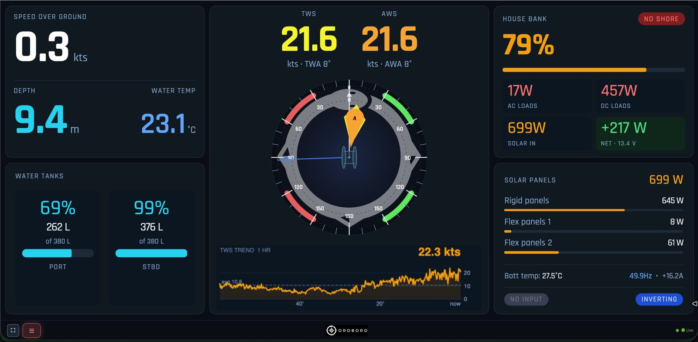
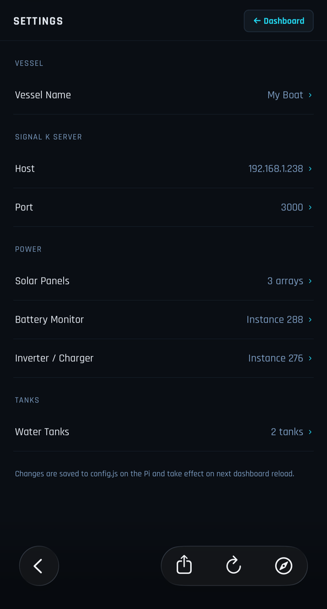
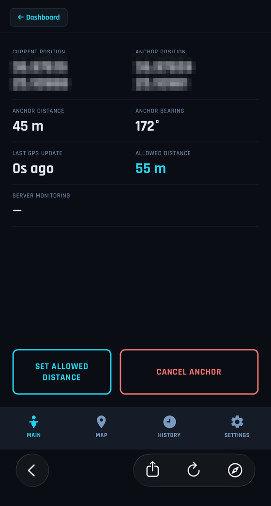
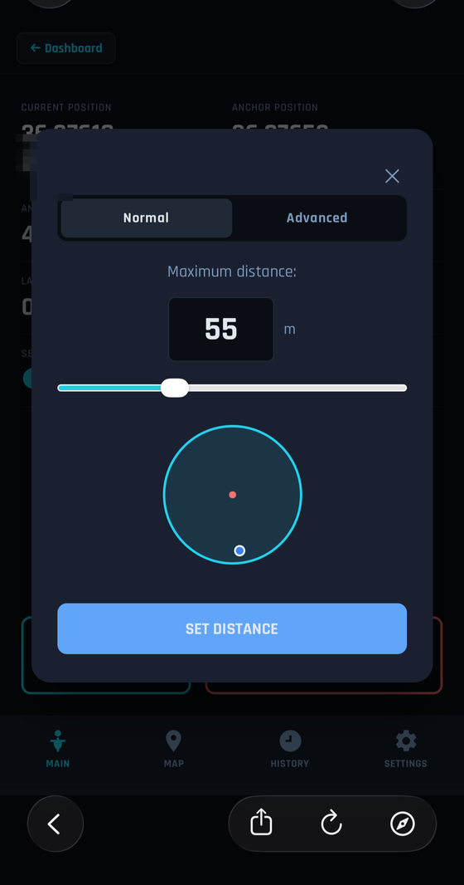
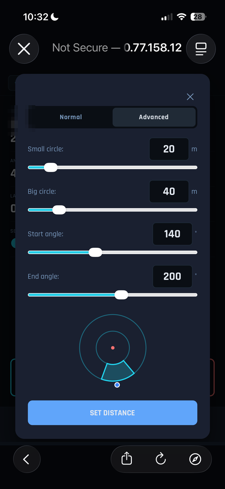
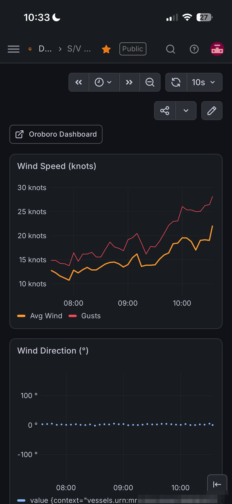

# Oroboro Dashboard

A complete marine instrument panel that runs on a **Raspberry Pi** aboard your boat — wind, navigation, depth, batteries, solar, tanks, anchor watch with phone alarms, and a full sailing-performance (polar) analyzer. Viewable on any phone, tablet, laptop, or a mounted cockpit screen, on board or from anywhere in the world.

Built on [Signal K](https://signalk.org), the open-source marine data standard. Total hardware cost: **roughly €150–300** — less than half the price of a Victron GX Touch panel, while showing your *whole boat* instead of only the electrical system.

Live aboard S/V Oroboro, a Leopard 40 sailing the Aegean → [sailingoroboro.com](https://sailingoroboro.com)



---

## What you get

- **Wind** — true and apparent speed and angle, interactive wind rose, 1-hour trend with gusts
- **Navigation** — SOG, depth, water temperature, heading
- **House battery** — state of charge, net power in/out (green when charging, red when draining), shore status
- **Solar** — total watts and per-array breakdown
- **Electrical** — AC loads, DC loads, inverter mode
- **Water tanks** — levels in percent and litres
- **Anchor watch** — set an anchor and an allowed zone on a map; if the boat drifts out, your phone gets an alarm via Pushover — even when you're ashore
- **Polar performance** — live "% of target" trim coach while sailing, GPS track colored by performance, your boat's theoretical polar (VPP) side by side with your own best achieved speeds, Expedition-style data table, CSV/GPX export
- **History** — every reading stored in a database on the Pi; browse graphs of wind, battery, depth over days or months (Grafana)

Everything updates live, works on any screen size, and needs no internet to function on board (internet is only needed for remote access and phone alarms).

---

## Why not just buy the Victron panel?

Fair question — the Victron Cerbo GX + GX Touch is the standard answer, and it's good hardware. Here's the honest comparison:

| | Victron Cerbo GX + GX Touch 50 | This project |
|---|---|---|
| Street price | ≈ €530–630 | ≈ €150–300 all-in |
| Shows batteries, solar, inverter, tanks | ✔ | ✔ |
| Shows wind, depth, SOG, heading | ✘ | ✔ |
| Anchor watch with phone alarms | ✘ | ✔ |
| Sailing performance / polar analysis | ✘ | ✔ |
| Long-term data history and graphs | Via Victron's VRM cloud | On the boat, yours, no cloud needed |
| View on your phone/tablet | ✔ (VictronConnect / VRM) | ✔ (any browser, no app) |
| Remote access from anywhere | ✔ (VRM) | ✔ (Tailscale, free) |
| Customizable | ✘ | Completely — it's plain HTML/JS you can edit |
| Warranty and support | 5 years, dealer network | You are the support department |

The one-line version: **the Victron panel shows you Victron. This shows you the boat.** The GX Touch is a fine electrical monitor, but it will never display your wind speed, your depth, your anchor circle, or how well you're sailing — and it costs 2–4× more.

### "But I need a Cerbo for my Victron gear…" — actually, you don't

Here's the part few people realize: **the Cerbo GX is just a small Linux computer running Venus OS — and Venus OS is open source.** Victron publishes an official Venus OS image for the Raspberry Pi. A €60 Pi running Venus OS does what a €300 Cerbo does: talks to your MPPTs, inverter, and battery monitor, feeds Victron's own VRM cloud portal, runs DVCC — the works.

Three ways to get Victron data into this dashboard, cheapest last:

1. **You already own a Cerbo (or any GX device):** keep it. It joins the boat WiFi and this dashboard reads it over the network. Zero extra cost.
2. **No Cerbo? Run Venus OS on a second Pi (≈ €90–150 total).** Venus OS is a complete operating system, so it needs its own dedicated Pi (a Pi 3 or Pi 4 — flash the official image). The Cerbo's built-in sockets are replaced by Victron **VE.Direct-to-USB cables** (≈ €30 each — one per MPPT/BMV) plugged into the Pi's USB ports. You still get the VRM portal, firmware updates for your gear, everything. What you give up vs. real Cerbo hardware: the rugged fanless case, very low power draw, built-in VE.Can/VE.Bus sockets (VE.Bus needs the MK3-USB adapter, ≈ €65), and Victron's warranty/support. For a cruising boat on a budget, the trade is usually easy.
3. **Skip Venus entirely (cheapest, fewest features):** Signal K can read VE.Direct devices *directly* over the same USB cables via a plugin — no second Pi, no Venus OS. You lose the VRM portal and DVCC coordination; you keep everything this dashboard shows. Good for simple systems (one MPPT + one shunt).

### What about all the Cerbo's sockets?

Fair objection: the Cerbo isn't just a computer, it's also an interface board — VE.Direct ports, VE.Bus, tank inputs, temperature inputs. A Pi replaces the computer for €60; the sockets are replaced piecemeal, and only where your boat actually uses them:

| Cerbo socket | What plugs into it | Pi-world replacement | Approx. cost |
|---|---|---|---|
| 3× VE.Direct | MPPTs, BMV/SmartShunt | One VE.Direct-to-USB cable per device | €30 each |
| VE.Bus | MultiPlus / Quattro inverter-charger | Victron MK3-USB interface | ≈ €65 |
| (not enough USB ports?) | — | Powered USB hub — a Pi has 4 ports, a hub adds more | €15–25 |
| 4× tank level inputs | Resistive tank senders | See below — the one genuine gap | €10–200 |
| 4× temperature inputs | Temp sensors | DS18B20 1-Wire sensors straight into the OpenPlotter Pi's GPIO (natively supported) | €2–3 each |
| Relays / digital inputs | Genset start, alarms | Pi relay HAT (DIY territory) | €10–20 |

**Tanks are the honest gap:** the Cerbo's tank inputs are *analog*, and a bare Pi has no analog inputs. Three real routes, by budget: **(a)** an ESP32 microcontroller running [SensESP](https://signalk.org/SensESP/) (€10–20) wired to your existing senders, feeding Signal K over WiFi — the Signal K community's favorite; **(b)** NMEA 2000 tank senders (€150–200 each) that bypass Victron entirely — cleanest if you're wiring tanks from scratch; **(c)** an MCP3208 ADC chip (≈ €5) soldered to the Venus-OS Pi — supported per the Venus-on-Pi wiki, most DIY.

**When the Cerbo *is* the right answer:** if your boat leans on several of those sockets — four tanks, temp sensors, VE.Bus, three MPPTs — the ≈ €200 premium over a Pi buys an integrated, ruggedized, supported interface board, and that's a fair trade. The point of this section isn't “Cerbo bad”; it's *know what you're paying for*, and know that every one of its functions has an open-source path.

---

## What it costs

Approximate street prices, mid-2026 — they drift, so treat as ballparks:

| Item | Approx. cost | Needed? |
|---|---|---|
| Raspberry Pi 4 (4 GB) or Pi 5 | €60–90 | Yes |
| Quality microSD card, 32 GB+ | €10 | Yes |
| 12 V → 5 V USB-C converter, 3 A+ (powers the Pi from the boat's DC) | €10–20 | Yes |
| NMEA 2000 interface — CAN HAT (MacArthur/PiCAN-M/Waveshare) | €20–90 | Yes, for a NMEA 2000 boat |
| — or USB gateway (Actisense NGT-1, Yacht Devices YDNU) | €170–200 | Alternative to the HAT |
| NMEA 0183 interface (older boats) — USB-RS422/RS485 adapter | €10–25 | Only for pre-N2K instruments |
| 4G/LTE WiFi router + data SIM | €50–150 + SIM plan | For remote access and phone alarms |
| Cockpit display, 7–9″ HDMI touchscreen (optional) | €60–120 | Optional |
| Second Pi + VE.Direct-USB cables for Venus OS (optional, see above) | €90–150 | Only if no Cerbo and you want VRM |

**Typical core build: €150–250.** With a cockpit touchscreen: €220–370. Compare with Cerbo GX + GX Touch 50 at ≈ €530–630 — which covers only the electrical column of the table above.

All software is free and open source: OpenPlotter, Signal K, InfluxDB, Grafana, Tailscale (free tier), and this dashboard.

---

## Hardware you'll need

### The basics

| Item | What it does | Notes |
|------|-------------|-------|
| **Raspberry Pi 4** (or newer) | Runs the Signal K server and serves the dashboard | 2 GB RAM is sufficient; 4 GB recommended |
| **MicroSD card** (32 GB+) | Stores the operating system and all software | Use a good quality card (SanDisk, Samsung) |
| **12 V → 5 V converter** | Powers the Pi from the boat's DC system | Must deliver a steady 5 V/3 A — **do not** share a single power source between the Pi and other devices like a router |
| **Instrument interface** | Connects your boat's instrument network to the Pi | See the next two sections — pick the one matching your boat |
| **WiFi router with SIM card** | Creates the boat's WiFi network and provides internet via cellular | Any 4G/LTE router works — make sure it has its own dedicated power supply |
| **Display** (optional) | A screen attached to the Pi for cockpit viewing | A 7–9″ HDMI touchscreen works well |

### Connecting to NMEA 2000 (most boats from ~2008 onward)

You need a way to get data from the boat's NMEA 2000 backbone into the Raspberry Pi. Two options:

**Option A — CAN bus HAT (recommended, cheapest)**

A HAT (Hardware Attached on Top) is a small circuit board that plugs directly onto the Pi's GPIO pins, turning the Pi itself into an NMEA 2000 device. Popular choices:

- **[OpenMarine MacArthur HAT](https://shop.wegmatt.com/products/openmarine-macarthur-hat)** — designed specifically for OpenPlotter, supports NMEA 2000, NMEA 0183, and Seatalk1 all in one board. Fully supported by OpenPlotter with just a few clicks to configure.
- **[PiCAN-M](https://copperhilltech.com/pican-m-nmea-0183-nmea-2000-hat-for-raspberry-pi/)** — supports NMEA 2000 and NMEA 0183, can optionally power the Pi from the NMEA 2000 bus itself.
- **[Waveshare 2-Channel CAN HAT](https://www.waveshare.com/2-ch-can-hat.htm)** — a general-purpose isolated CAN bus board that works well with NMEA 2000; the budget option.

To connect a HAT to the NMEA 2000 backbone, you tap into the backbone cable:

1. **Get a spare NMEA 2000 drop cable** (or cut into an existing cable at a convenient point). The standard NMEA 2000 cable contains five wires:

   | Wire color | Name | Purpose |
   |-----------|------|---------|
   | **White** | CAN-H (Net-H) | Data signal — high |
   | **Blue** | CAN-L (Net-L) | Data signal — low |
   | Bare (no insulation) | Shield | Electromagnetic shielding |
   | Red | Net-S | 12 V power (not needed for the HAT) |
   | Black | Net-C | 12 V ground (not needed for the HAT) |

2. **Strip the white and blue wires** — these are the only two you need. The HAT has screw terminals labeled CAN-H and CAN-L. Connect **white → CAN-H**, **blue → CAN-L**.

3. **Leave the red and black power wires disconnected** (or capped with electrical tape) — the Pi powers the HAT. The bare shield wire can be left disconnected or tied to a boat ground for extra noise protection.

4. **Plug the HAT onto the Pi's GPIO header**, boot, and configure it in OpenPlotter's CAN Bus app — the HAT appears automatically; click "Add Connection" to link it to Signal K.

> **Important:** The NMEA 2000 backbone must have exactly two 120 Ω termination resistors, one at each physical end. Adding the HAT tap doesn't change this — you're adding a drop, not extending the backbone. Verify by measuring resistance between white and blue with the network powered off: ≈ 60 Ω means correct (two 120 Ω in parallel).

**Option B — USB gateway (plug and play, more expensive)**

A small box that plugs into the backbone via a standard drop cable on one side and into the Pi via USB on the other. No wiring, no soldering.

- **[Actisense NGT-1](https://actisense.com/products/nmea-2000-to-pc-interface-ngt-1/)** — the most widely used and best-supported gateway in the Signal K community
- **[Yacht Devices YDNU-02](https://www.yachtd.com/products/usb_gateway.html)** — compact, well-regarded alternative

Signal K detects USB gateways automatically — nothing to configure beyond plugging in.

### Older boats: NMEA 0183 and Seatalk (pre-~2008 instruments)

If your instruments predate NMEA 2000, they likely speak **NMEA 0183** (a serial protocol) or Raymarine **Seatalk1**. Both are easy and *cheap* to connect:

- **NMEA 0183:** a **USB-to-RS422/RS485 serial adapter** (€10–25) between the instrument's data wires and any Pi USB port. In OpenPlotter's Serial app, assign the port to Signal K, set the baud rate (usually 4800, or 38400 for AIS), done. One adapter per 0183 talker.
- **Seatalk1:** the **MacArthur HAT** reads it natively — or a well-documented one-transistor DIY circuit into a GPIO pin, configured in OpenPlotter's Seatalk app.
- **Mixed boats** (e.g. new N2K wind, old 0183 GPS) are fine: Signal K merges every source into one unified data model. That's its whole point.

### Victron energy monitoring (optional but recommended)

Whichever of the three integration paths you chose above ("But I need a Cerbo…"), the Victron side of your system is unchanged: MPPTs, inverter/charger, and a battery monitor (BMV/SmartShunt) connect to the GX device (Cerbo or Venus-on-Pi) via their normal VE.Direct/VE.Bus cables. The GX device joins the boat WiFi and publishes data via MQTT; this dashboard reads it through Signal K's Venus plugin.

A battery **shunt** (BMV-712, SmartShunt) is what enables the dashboard's *net power* display — the single number telling you whether the bank is filling or draining right now.

---

## How everything connects

```
Boat Instruments (wind, depth, GPS, heading)
│
│  NMEA 2000 backbone (blue cable)      Older instruments (NMEA 0183 / Seatalk1)
│                                        │
├──► CAN bus HAT (on Pi GPIO)  ──┐       └──► USB-serial adapter ──┐
│    White wire → CAN-H          │                                 │
│    Blue wire  → CAN-L          ▼                                 ▼
└──► USB Gateway (alt.) ──USB──▶ Raspberry Pi ◀────────────────────┘
                                    │
                                    ├── Signal K server (unifies all instruments)
                                    ├── InfluxDB (stores history) + Grafana (graphs)
                                    ├── Dashboard (oroboro.html)
                                    ├── Polar performance (polar.html)
                                    ├── Anchor watch (anchor.html) + proxy service
                                    └── Settings (settings.html)
                                    │
                                    ▼  WiFi
                              WiFi Router (with SIM)
                              │           │
                              ▼           ▼
                         Your phone    GX device (Cerbo,
                         / tablet      or Venus OS on a Pi)
```

### The WiFi router

The router creates the boat's WiFi network and provides internet via its SIM. Every device — the Pi, the GX device, your phone — joins this network. **The router must have its own dedicated power supply.** Powering it from the Pi's USB port causes voltage drops that destabilize both devices.

Internet is required only for: remote access (Tailscale), anchor alarms to your phone (Pushover), and Victron's VRM portal. Everything on-board works without it.

---

## Software setup

### Step 1: Install OpenPlotter on the Raspberry Pi

[OpenPlotter](https://openplotter.readthedocs.io/) is a ready-made operating system for the Pi that includes Signal K and all the marine software you need.

1. Download the latest OpenPlotter image from [openplotter.readthedocs.io](https://openplotter.readthedocs.io/)
2. Flash it to the microSD with [Raspberry Pi Imager](https://www.raspberrypi.com/software/)
3. Insert, connect display and keyboard, boot
4. Follow the OpenPlotter setup wizard — it configures Signal K automatically
5. Connect your NMEA interface (HAT or USB) — OpenPlotter detects it

Signal K's admin interface is then at `http://<pi-ip-address>:3000` from any device on the boat WiFi.

### Step 2: Give the Pi a static IP address

So the dashboard URL never changes:

```bash
sudo nmcli connection modify "YourWiFiName" ipv4.method manual ipv4.addresses 192.168.1.238/24 ipv4.gateway 192.168.1.1 ipv4.dns 8.8.8.8
sudo nmcli connection down "YourWiFiName" && sudo nmcli connection up "YourWiFiName"
```

Replace the IP and WiFi name with your own.

### Step 3: Connect your Victron system (pick your path)

**Path 1 — you have a Cerbo/GX device:**
1. On the GX device: **Settings → Services → MQTT on LAN → ON**
2. Join it to the boat WiFi, note its IP (give it a static IP too, via its own Settings)
3. Signal K admin → **Server → Plugin Config → Victron Venus Plugin** → set the MQTT host to the GX IP, and "Address for remote Venus device" to `tcp:host=<gx-ip>` → save, restart Signal K

**Path 2 — Venus OS on a second Pi (no Cerbo):**
1. Flash the official [Venus OS for Raspberry Pi](https://github.com/victronenergy/venus/wiki/raspberrypi-install-venus-image) image to a Pi 3/4
2. Plug your VE.Direct-USB cables (one per MPPT/BMV) into that Pi
3. From there it *is* a GX device — follow Path 1's steps against its IP

**Path 3 — no Venus at all:** install a Signal K VE.Direct plugin (Appstore tab in Signal K admin), plug VE.Direct-USB cables directly into the OpenPlotter Pi, assign the serial ports. Simplest wiring, no VRM.

### Step 4: Install the PNA header plugin

Chrome on iOS blocks certain local-network connections unless the server sends a specific header:

```bash
sudo mkdir -p /home/pi/.signalk/node_modules/signalk-pna-header
sudo wget -q -O /home/pi/.signalk/node_modules/signalk-pna-header/index.js \
  https://raw.githubusercontent.com/fpugliano/oroboro-dashboard/main/signalk-plugin/index.js
sudo wget -q -O /home/pi/.signalk/node_modules/signalk-pna-header/package.json \
  https://raw.githubusercontent.com/fpugliano/oroboro-dashboard/main/signalk-plugin/package.json
sudo chown -R pi:pi /home/pi/.signalk/node_modules/signalk-pna-header
echo '{"configuration":{},"enabled":true}' \
  > /home/pi/.signalk/plugin-config-data/signalk-pna-header.json
sudo systemctl restart signalk
```

### Step 5: Deploy the dashboard files

```bash
cd /usr/lib/node_modules/signalk-server/public
sudo wget -q -O oroboro.html  https://raw.githubusercontent.com/fpugliano/oroboro-dashboard/main/oroboro.html
sudo wget -q -O anchor.html   https://raw.githubusercontent.com/fpugliano/oroboro-dashboard/main/anchor.html
sudo wget -q -O polar.html    https://raw.githubusercontent.com/fpugliano/oroboro-dashboard/main/polar.html
sudo wget -q -O settings.html https://raw.githubusercontent.com/fpugliano/oroboro-dashboard/main/settings.html
sudo wget -q -O oroboro-rose-logo.svg https://raw.githubusercontent.com/fpugliano/oroboro-dashboard/main/oroboro-rose-logo.svg
sudo wget -q -O config.js     https://raw.githubusercontent.com/fpugliano/oroboro-dashboard/main/config.js
sudo chown pi:pi config.js
```

> ⚠️ **config.js is special — download it ONCE.** It's the file where *your* boat's private values live: tank capacities, Pushover keys, database token. The copy on GitHub contains only placeholders. After this first download you'll edit it on the Pi (Step 7 and Step 8), and you must **never wget it again** — that would overwrite your real values with placeholders. Update commands later in this README deliberately exclude it.

### Step 6: Set up the Anchor Watch proxy

The anchor watch needs a small background service for secure communication with Signal K:

```bash
mkdir -p /home/pi/anchor-api
wget -O /home/pi/anchor-api/anchor-api.js \
  https://raw.githubusercontent.com/fpugliano/oroboro-dashboard/main/anchor-api.js
wget -O /home/pi/anchor-api/anchor-api-config.json \
  https://raw.githubusercontent.com/fpugliano/oroboro-dashboard/main/anchor-api-config.json

nano /home/pi/anchor-api/anchor-api-config.json
# Fill in "username" and "password" with your Signal K admin credentials, save (Ctrl+O, Enter, Ctrl+X)

sudo wget -O /etc/systemd/system/anchor-api.service \
  https://raw.githubusercontent.com/fpugliano/oroboro-dashboard/main/anchor-api.service
sudo systemctl daemon-reload
sudo systemctl enable anchor-api
sudo systemctl start anchor-api

sudo systemctl status anchor-api
# You should see "Authenticated to Signal K" and "Listening on port 3001"
```

### Step 7: History and polar performance — InfluxDB + Grafana

This step powers the polar page's track and statistics, and the Grafana history graphs. All three tools install from OpenPlotter/apt or their official docs; the short version:

1. **Install InfluxDB 2** on the Pi and create an organization (e.g. `Oroboro`) and a bucket (e.g. `signalk`) during its setup wizard at `http://<pi-ip>:8086`.
2. **Install the `signalk-to-influxdb2` plugin** from Signal K's Appstore. In its config, point it at `http://<pi-ip>:8086`, your org and bucket. **Token:** create an **All Access API token** in the InfluxDB UI (Load Data → API Tokens) for the plugin — it needs to look up the organization, which bucket-scoped tokens can't do. Choose which Signal K paths to log (position, wind, speeds, battery at minimum).
3. **Dashboard read token:** create a **second, read-only token** scoped to the bucket, and put it in the Pi's `config.js` under the `influx:` section (`sudo nano /usr/lib/node_modules/signalk-server/public/config.js`). The dashboard only ever reads — never give the page a write-capable token.
4. **Grafana (optional):** install, add InfluxDB as a data source with a third read token, build panels or import a community marine dashboard. Tip: set `enable_gzip = true` in `/etc/grafana/grafana.ini` — it makes remote loading several times faster.

> Security note: the tokens live **only on the Pi** — in the plugin config and in the Pi's config.js. Never commit real tokens to a public repository. The repo's config.js ships with placeholders for exactly this reason.

### Step 8: Configure your boat's specifics

Open `http://<pi-ip>:3000/oroboro.html` and tap **☰ → Settings** to configure vessel name, solar arrays (use "Scan Signal K" to auto-discover), battery monitor instance, inverter instance, and tank paths/capacities. Changes save automatically.

<p align="center"></p>

For the polar page, the theoretical polar (VPP) in `polar.html` is Oroboro's — a Leopard 40, main + jib. If your boat differs, edit the `OFFICIAL_POLAR` table in the file with your boat's VPP numbers (your designer or class association usually has them); everything else adapts automatically.

### Step 9: Pushover notifications (optional)

To receive anchor alarms on your phone:

1. Install the **Pushover** app ([iOS](https://apps.apple.com/app/pushover-notifications/id506088175) / [Android](https://play.google.com/store/apps/details?id=net.superblock.pushover))
2. Create an account at [pushover.net](https://pushover.net) — your **User Key** is on the main page
3. Create an application at [pushover.net/apps/build](https://pushover.net/apps/build) — this gives the **API Token**
4. Enter both in the Pi's `config.js` (pushover section), or via ⚓ → Settings

---

## Using the dashboard

### Instruments

Open `http://<pi-ip>:3000/oroboro.html` on any device on the boat WiFi. Updates every second, no refresh needed. The ⛶ button toggles fullscreen (ideal for a mounted cockpit screen); ☰ opens the menu to the other pages.

### Anchor watch

1. ☰ → **Anchor watch**
2. **Set Allowed Distance** — a simple circle, or a directional sector in Advanced mode
3. **Set Anchor** — Current Location (GPS) or Relative (distance + bearing to where the hook actually is)
4. The map shows boat, anchor, allowed zone, nearby AIS targets, and your swing track
5. Drift outside the zone → Pushover alarm on your phone. Alarms are sent directly from the Pi and work whether or not you're connected to the boat — only the Pi's internet matters
6. Anchor state syncs across all devices

<p align="center">
  &nbsp;
  &nbsp;
  
</p>

### Polar performance

☰ → **Polar performance**. While sailing, the live strip shows boat speed against a target with a colored gap chip and a plain-language trim hint. The **VPP / My best** switch decides what "target" means:

- **VPP** — the designer's theoretical polar (full sail). The racer's yardstick.
- **My best** — the best *you* have actually sailed at that wind speed and angle. This is the cruiser's yardstick: it automatically accounts for your real sail choices (reefed in 25 knots? your 25-knot bests were reefed too).

**Load Data** fetches your recent sailing from InfluxDB: the map draws your track colored by performance (green = at your polar, red = well under, gray = no reference), tap any point for the full numbers at that moment. Simple view shows cruiser stats (time on target, average gap); Analysis view adds VMG records, the raw data cloud, and the full VPP-vs-best table. Export CSV/GPX to take data anywhere.

### History (Grafana)

☰ → **History** opens Grafana for long-term graphs — wind over the last week, battery over the season. Tip: add a dashboard link in Grafana pointing back to `oroboro.html` for easy two-way navigation.

<p align="center"></p>

---

## Remote access via Tailscale

Access everything from anywhere in the world — not just on the boat WiFi — using [Tailscale](https://tailscale.com), a free VPN that creates a private encrypted network between your devices and the Pi.

### How it works

Each device gets a private `100.x.x.x` address that only your devices can reach. From a café or home, `http://100.x.x.x:3000/oroboro.html` behaves exactly like being aboard. Nobody else can see or reach the Pi.

### Setting it up

**On the Pi:**

```bash
sudo rm -f /etc/apt/sources.list.d/nodesource* /etc/apt/sources.list.d/openplotterNodejs.list /etc/apt/preferences.d/99nodesource
sudo apt-get update && sudo apt-get install -y tailscale
sudo tailscale up
```

Open the URL it prints, sign in (Google, GitHub, Microsoft, or Apple — **remember which one you pick**, every device must use the same), approve the device. Get the Pi's address with `tailscale ip -4`.

**On phones/laptops:** install the Tailscale app, sign in with the *same* account and provider, allow the VPN prompt. If a device can't be signed in easily, the admin console at [login.tailscale.com](https://login.tailscale.com/admin/machines) can generate a share link/QR code to enroll it without provider credentials.

**Two settings worth doing once** in the admin console: **Disable key expiry** on the Pi (three-dot menu next to the machine — otherwise it needs re-authentication every 180 days), and note the Pi's MagicDNS name (usually `openplotter`) — then `http://openplotter:3000/oroboro.html` works and is easier to remember than the IP.

### Anchor alarms work independently

Pushover alarms go straight from the Pi to Pushover's servers — they need the Pi's internet, not Tailscale. You'll get the alarm on your phone ashore even with Tailscale off.

---

## Updating the dashboard

When new versions are published:

```bash
cd /usr/lib/node_modules/signalk-server/public
sudo wget -q -O oroboro.html  https://raw.githubusercontent.com/fpugliano/oroboro-dashboard/main/oroboro.html
sudo wget -q -O anchor.html   https://raw.githubusercontent.com/fpugliano/oroboro-dashboard/main/anchor.html
sudo wget -q -O polar.html    https://raw.githubusercontent.com/fpugliano/oroboro-dashboard/main/polar.html
sudo wget -q -O settings.html https://raw.githubusercontent.com/fpugliano/oroboro-dashboard/main/settings.html
grep -c "DASHBOARD_CONFIG" oroboro.html && echo "update ok"
```

**Never re-download config.js** — it holds your boat's real values (see Step 5). If the browser shows an old version afterwards, hard-refresh; on the Pi's own Chromium:

```bash
pkill -9 chromium
rm -rf /home/pi/.config/chromium/Default/Cache "/home/pi/.config/chromium/Default/Code Cache" /home/pi/.config/chromium/Default/Service\ Worker
chromium-browser --incognito http://<pi-ip>:3000/oroboro.html &
```

---

## Troubleshooting

### Dashboard shows no data
- Signal K running? `sudo systemctl status signalk`
- Pi on WiFi? `nmcli connection show --active`
- Live values in Signal K admin → Data Browser?

### Battery/solar missing but wind/depth work
- Wind/depth come via NMEA — if these work, the Pi side is fine
- Battery/solar come from the GX device via MQTT over WiFi: is it on the same WiFi, is MQTT on LAN enabled, is the Venus plugin pointed at the right IP, did its IP change?

### Polar page loads no historical data / empty track
- "Token not configured" in the status line → the `influx:` section is missing or wrong in the Pi's config.js (Step 7.3)
- Data loads but no track → check the browser console; the page prints exactly which position field came back empty
- Verify the logger writes: InfluxDB UI → Data Explorer, or check `sudo journalctl -u signalk | grep -i influx` for plugin errors (a bucket-scoped token in the *plugin* causes "No organization named … found" — the plugin needs the all-access token)

### Anchor watch not working
- Proxy running? `sudo systemctl status anchor-api`, logs via `sudo journalctl -u anchor-api -n 20`
- "Authenticated to Signal K" and "Listening on port 3001" expected; auth failures → check `/home/pi/anchor-api/anchor-api-config.json`

### Browser shows an old version after update
- Cache. Hard refresh; on stubborn mobile browsers append `?v=2` to the URL; on the Pi use the cache-clearing block above

### WiFi keeps disconnecting
- Router must have its own power supply — never the Pi's USB port
- `nmcli -f NAME,AUTOCONNECT connection show` — disable autoconnect on every network except the boat's

---

## Files in this project

| File | Purpose |
|------|---------|
| `oroboro.html` | Main dashboard — instruments, wind rose, battery, solar, tanks |
| `polar.html` | Polar performance — live trim coach, track, VPP vs achieved analysis |
| `anchor.html` | Anchor watch — map, alarm zones, notifications |
| `settings.html` | Settings page — solar, tanks, battery, inverter, vessel |
| `config.js` | Boat configuration — placeholders in the repo, **real values live only on your Pi** |
| `oroboro-rose-logo.svg` | Logo artwork used by the wind rose |
| `anchor-api.js` / `anchor-api-config.json` / `anchor-api.service` | Anchor watch background service, its credentials (Pi-only), and its systemd unit |
| `signalk-plugin/` | The PNA header plugin (Step 4) |

## Signal K plugins required

| Plugin | Purpose | Needed for |
|--------|---------|-----------|
| **Victron Venus Plugin** | Bridges GX-device battery/solar/inverter data into Signal K via MQTT | Battery, solar, tanks (Paths 1–2) |
| **signalk-anchoralarm-plugin** | Stores anchor position state in Signal K | Anchor watch |
| **signalk-pna-header** | Network-access headers for iOS browsers | iPhone/iPad access |
| **signalk-to-influxdb2** | Logs selected paths to InfluxDB | Polar history, Grafana |

---

## License

Licensed under [CC BY-NC 4.0](LICENSE) — free for sailors. Install it on your boat, modify it, share it with the fleet, credit S/V Oroboro. **Commercial use — selling it, bundling it into paid products, or charging for installations — requires written permission.** No warranty of any kind: **this software must never be your only anchor watch or navigation source.** A postcard from a nice anchorage is always welcome.

---

## About

Built and sailed in earnest aboard S/V Oroboro, a Leopard 40 in the Aegean → [sailingoroboro.com](https://sailingoroboro.com)
