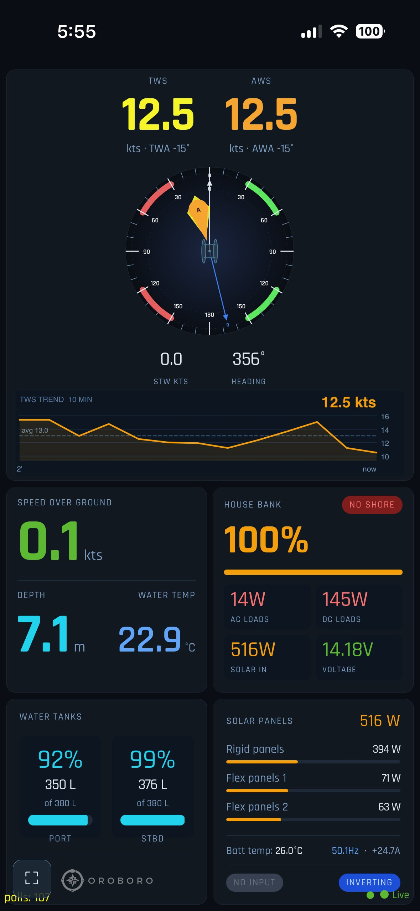
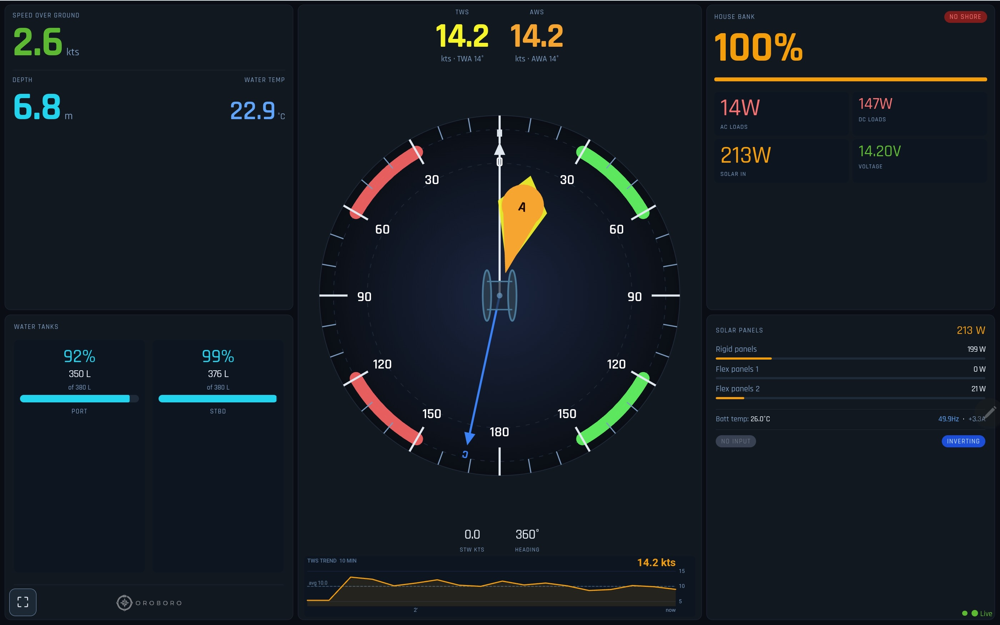

# Oroboro Dashboard

Real-time marine instrument dashboard for S/V Oroboro. Served from a Raspberry Pi running OpenPlotter and Signal K. Displays live data from NMEA2000 and Victron/Cerbo GX on any device connected to the boat's WiFi.

Part of the Oroboro sailing project → [sailingoroboro.com](https://sailingoroboro.com)

---

## Screenshots




---

## What it shows

- **Wind** — TWS, AWS, TWA, AWA, wind rose with true and apparent wind needles
- **Navigation** — SOG, STW, heading, depth, water temperature
- **TWS Trend** — 10-minute true wind speed chart with average reference line
- **House Bank** — battery state of charge %, voltage, current
- **Electrical** — AC loads, DC loads, solar input, inverter mode, shore power status
- **Solar Panels** — total watts + individual array breakdown with progress bars
- **Water Tanks** — PORT and STBD levels in % and litres
- **Anchor Watch** (`anchor.html`) — GPS anchor alarm with Pushover notifications, swing track, directional sector mode

---

## Architecture
Boat instruments (NMEA2000)
│
▼
Raspberry Pi (OpenPlotter)
├── Signal K server (port 3000)
│     └── Venus plugin → Cerbo GX (MQTT at 192.168.1.212)
└── Dashboard served at /oroboro.html
│
▼ HTTP polling every 1 second
│
┌────┴────┐
│ Alcatel │  ← boat WiFi router (Oroboro network)
│  router │  ← powered from Pi USB (5V/2A)
└────┬────┘
│ ethernet
▼
Cerbo GX (192.168.1.212)
│
▼ VE.Direct / VE.Can / VE.Bus
Victron devices (MPPT, Multiplus, BMV-712, batteries)

---

## Network

| Device | IP | Notes |
|---|---|---|
| Alcatel router | 192.168.1.1 | Creates `Oroboro` WiFi, powered from Pi USB |
| Raspberry Pi | 192.168.1.238 | Static IP, runs Signal K + dashboard |
| Cerbo GX | 192.168.1.212 | Connected to router via ethernet |

**Access:**
- Dashboard: `http://192.168.1.238:3000/oroboro.html`
- Victron: `http://192.168.1.212`
- Signal K admin: `http://192.168.1.238:3000`

---

## Installation

### 1. Enable MQTT on Cerbo GX
On the Cerbo touchscreen: **Settings → Services → MQTT on LAN → ON**

### 2. Configure Signal K Venus plugin
Edit `/home/pi/.signalk/plugin-config-data/venus.json`:
```json
{
  "configuration": {
    "installType": "mqtt",
    "MQTT": { "host": "192.168.1.212" }
  },
  "enabled": true
}
```
Replace `192.168.1.212` with your Cerbo's actual IP.

### 3. Install the PNA header plugin
```bash
sudo mkdir -p /home/pi/.signalk/node_modules/signalk-pna-header
sudo wget -q -O /home/pi/.signalk/node_modules/signalk-pna-header/index.js \
  https://raw.githubusercontent.com/fpugliano/oroboro-dashboard/main/signalk-plugin/index.js
sudo wget -q -O /home/pi/.signalk/node_modules/signalk-pna-header/package.json \
  https://raw.githubusercontent.com/fpugliano/oroboro-dashboard/main/signalk-plugin/package.json
sudo chown -R pi:pi /home/pi/.signalk/node_modules/signalk-pna-header
echo '{"configuration":{},"enabled":true}' \
  > /home/pi/.signalk/plugin-config-data/signalk-pna-header.json
sudo systemctl restart signalk
```

### 4. Deploy the dashboard
```bash
sudo wget -O /usr/lib/node_modules/signalk-server/public/oroboro.html \
  https://raw.githubusercontent.com/fpugliano/oroboro-dashboard/main/dashboard.html
sudo wget -O /usr/lib/node_modules/signalk-server/public/config.js \
  https://raw.githubusercontent.com/fpugliano/oroboro-dashboard/main/config.js
sudo wget -O /usr/lib/node_modules/signalk-server/public/anchor.html \
  https://raw.githubusercontent.com/fpugliano/oroboro-dashboard/main/anchor.html
```

`config.js` is the single source of truth for all boat-specific settings (tank paths, solar IDs, battery instance, etc.). Edit it to match your setup before deploying. Add your Pushover `userKey` and `apiToken` to the `anchor.pushover` section to enable anchor alarm notifications.

### 5. Updating
1. Edit on laptop with Claude Code → push to GitHub
2. Switch Pi to a WiFi network with internet
3. Run all three wget commands above (`dashboard.html`, `config.js`, `anchor.html`)
4. Switch Pi back to boat WiFi

---

## Technical notes

- Uses HTTP polling — Chrome on iOS blocks WebSocket to local IPs without `Access-Control-Allow-Private-Network: true`
- The `signalk-pna-header` plugin adds this header to all Signal K responses
- Venus plugin must point to the Cerbo's actual IP, not `venus.local`
- MQTT must be enabled on the Cerbo

---

## License

MIT — see [LICENSE](LICENSE)

---

## About

Built by Francesco & Yuka aboard S/V Oroboro — Cape Town to Greece, 2018–present.

- 🌐 [sailingoroboro.com](https://sailingoroboro.com)
- 📸 [Instagram](https://www.instagram.com/sailingoroboro/)
